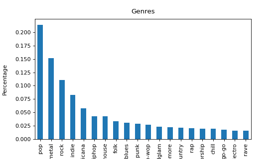

Linköping University

Text Mining (732A92)

```{r setup, include=FALSE}
knitr::opts_chunk$set(echo = F, warning = F, message = F)
```

\newpage


# Abstract
**TODO**
Methods that takes the word order in consideration and methods that does not

\newpage

\tableofcontents 

\newpage


# Introduction 

**TODO**

To compare the results of both models I choose to compare the accuracy and the
$f1-score$. 

# Lyrics

There was no available dataset that fitted the idea to classify the song genre 
using the lyrics. To be able to solve the problem I first downloaded the dataset 
“Spotify music genre list and 80k songs/tracks” @kaggle referred as songDB,
I was able to get 
the genre from each song but not the lyrics from all over the world. This was 
solved by using both the Spotify API, @spotify, to acquire the song name 
and artist. Later, by using the lyricsgenius library, @lyricsgenius, to get the song lyrics 
from a given song title and artist. Downloading the lyrics was time consuming, 
each lyric takes up to 3 seconds to download, because of the limitations 
of the API. 

## Cleaning the lyrics

There was a need of cleaning the text by removing explanatory parts of the text, 
i.e. verse, solo etc. And some of the lyrics consisted of multiple languages
in the same string. This problem was solved by identifying that if the existed 
an English version of the lyrics it was shown by ether [English] or 
[English Translation] with this information I was able to remove the non-English 
parts of the lyrics.


## Classifing language

Since music lyrics may consist of made up words or borrowing words or sentences
from different languages. I was able to match the language of each lyrics using 
the *spacy* library function *spacy_langdetect* that detects which language each 
sentence of a text with a probability. To classify a lyric to a specific language
I added all the probabilities from each language class and selected the highest 
value as the lyrics language.


## Lyrics after cleaning

Using the lyricsgenius library to get the lyrics had some problems with lyrics to
songs related to plays and movies and returns the whole lyrics to a play or movie. 
According to @guinnes the most words in a single lyrics is held by
Eminem with the song Rap God, with has a total words of 1560 words. 
This led to the number of words of the dataset visulized in the Figure 1, with 
the average number of words in a song lyric to be $289.7$. The problem was 
solved by removing lyrics with more than 1560 words.

{height=20%}

\newpage

One other problem was that there exist 117 different music genre in the *songDB* 
dataset joined with the English lyrics cleaned dataset. 
In some cases the genres are named after the country plus the genre, e.g. 
celticmetal and balkantrap into metal and rap, shown in **appendex**. 
With this method I reduced the number of genres from 117 to 59, and selected 
the top 20 music genres, shown in the Figure 2. 

{height=30%}


\newpage

# Models

In this paper we focus on two different text classification methods to 
try classifying the song genre only using the lyrics, one method that has the 
ordering of the words as a consideration (Long Short-Term Memory) and the other 
method that does not (Multinomial Naive Bayes). 

## Neural Network with memory

### Recurrent Neural Networks

Machines are build by humans and can sometimes be similar in the way they think
and understand certain things. Words are one of these things that are not easily 
understandable form one word, you may need previews words to understand the meaning
of the word in question. Recurrent Neural Network RNN deals with this issue with 
networks with loops that allowing the information to presist, and the outputs
used as a input while having hidden states. @lstmb 


{height=20%}

In the Figure 3, the chunk of a neural network, has the input $x^{t}$
,with the activation $a^t$ has the outputs a value $y^{t}$ @lstmb.
The loop allows the information to be passed from one step to one other step,
where,

$$a^t = g_1(W_{aa}a^{t-1}+W_{ax}x^t+b_a)$$

and 

$$y^t=g_2(W_{ya}a^t+b_y)$$

We define $W_{aa},W_{ax},W_{ya},b_a,b_y$ as shared temporally coefficients and
$g_1$ and $g_2$ are activation functions. @stanford


{height=40%}

In Figure 4, we get a more visualized view of RNN and how the corresponding 
coefficients and activation functions working together, @stanford.

\newpage

Compared to other classifying methods that exist is possibility to processing 
input of any length and the size of the model does not increase with the size 
of the input. We can as described above access historical information into 
account of computations and the weights are shared across time. The disadvantages
of using RNN is that the computations are slow, difficulty of accessing 
information on a large time frame and it cannot consider information any future 
inputs. @stanford

#### Loss Function 

In a RNN we define the loss function as $\mathcal{L}$. In this paper I use the 
categorical crossentropy loss function, that is designed for multiclass 
classification tasks. The Loss function is directly
related to the activation function used in the output layer. That computes the 
total loss of the model,

$$\mathcal{L}= \sum_{t=1}^{Y_n}y_i\times\log\hat y_i$$

Where the $\hat y_i$ is the $i-th$ scalar value in the output of the model and 
$y_i$ is the corresponding target value, that matches the output size. @peltarion

At a given time T, the derivative of the loss with respect to W is expressed as, 


$$\frac{\partial  \mathcal{L}^T}{\partial W} = \sum_{t=1}^T \frac{\partial \mathcal L^T}{\partial W}\bigg|_t$$
@stanford


#### Sigmoid

Sigmoid or Logistic activation function, is a function with the characteristics
that only can return a value strictly between 0 to 1. the function is both 
differentiate and monotonic, but the functions derivative is not monotinic.
the sigmoid function is defined as,

$$g(z)=\frac{1}{1+e^{-z}}$$

@sagar


#### Tahn

Tahn also known as the hyperbolic tangent activation function that has a range
strictly between -1 to 1, similar to the sigmoid function, Tahn is also 
differentiate and monotonic, but the derivative is not monotonic.
The function is mostly used as a classifying method between two classes. @sagar

The Tahn function is defined as,

$$g(z) = \frac{e^z-e^{-z}}{e^z+e^{-z}} $$
@stanford


#### Softmax

The softmax function transform a vector of N real values into N real values 
that will sum up to 1. That means that they can be interpreted as probabilities
for a given class. The softmax formula, 

$$g(z)_i = \frac{e^{z_i}}{\sum_{j=i}^Ke^{z_j}} $$
where K is the number of classes in the multiclass. @softmax

#### Exploding/Vanishing Gradient and Gradient Clipping

As discussed, the RNN may have problems capture ling term dependencies 
of multiple layers because of the multiplicative gradient that can be decreasing 
or increasing exponentially. Therefore, it's common to have vanishing and exploding
gradient to discard the exponentially changing gradient problem. 

The technique used to cope with the exploding gradient is called Gradient Clipping. 
The technique is to chopping the maximum value of the gradient, as shown in Figure 5.

```{r,eval=F}
library(latex2exp)
png("images/gradient.png",width = 400,height = 300)
x <- seq(0,8,0.1)
y <- ifelse(x < 4,x,4)
plot(x,y,type='l', col="green",ylim=c(-.5,5),xaxt='n',yaxt='n',ylab="",xlab="",
     main="",xlim=c(0,6))
abline(h=0,v=0,col="gray",lty=3)
lines(x=c(4,4),y=c(-.3,.3))
lines(x=c(-.3,.3),y=c(4,4))
lines(x=c(.3,4),y=c(4,4),lty=3,col="darkgray")
lines(x=c(4,4),y=c(.3,4),lty=3,col="darkgray")
text(x=1,y=4.5,TeX("|| $\\Delta L$ ||_{clipped}"))
text(x=5,y=.5,TeX("|| $\\Delta$L ||"))
text(x=.2,y=3.4,"C")
text(x=3.6,y=.2,"C")

#save.image("images/gradient.png")
dev.off()
```


### Long Short-Term Memory

The core idea of the Long Short-Term Memory (LSTM) is to get a horizontal line
running through the cell, so the information from previews cells with only some
minor linear interactions. That gives the LSTM the ability to remove or add
information to the cell state under carefully regulated structures we define as 
gates $(\Gamma)$. The gates are used as a way to let the information pass through, composed
out of a sigmoid neural net. Using the characteristics of the sigmoid function, 
the output from each sigmoid layer illustrates how much each component should be
let through. @lstmb

The gates are used to manage the gradient problem, specific gates are used in 
some types of RNN, and equal to, 

$$\Gamma = \sigma(Wx^t+Ua^{t-1}+b) $$

where $\sigma$ is the sigmoid function and $W,U,b$ are specific coefficients to 
the gate, @stanford. There exists 4 different types of gates in LSTM described in table 1.  

\begin{table}[h!]
\begin{center}
 \begin{tabular}{c | c} 
 \hline
 Types of gates ($\Gamma$) & Role of the gate \\ [0.5ex] 
 \hline
 $\Gamma_u$, update & How much of the past should be considered? \\ 

 $\Gamma_r$, relevance & Previous information drooped?  \\
 
 $\Gamma_f$, forget & If the cell should be drooped? \\

 $\Gamma_o$, output  & How much is revealed from a cell? \\[1ex] 
 \hline
\end{tabular}
\caption{4 different types of gates, Amidi and Amidi (2019)}

\end{center}
\end{table}

We define the characterization functions as $c'^t, c^t, a^t$, where

$$c'^t = tanh[W_c(\Gamma_r \times a^{t-1},x^t) + b_c] $$

$$c^t=\Gamma_u\times c'^t+\Gamma_f\times c^{t-1} $$

$$a^t=\Gamma_o\times c^t $$

In Figure 6, we can see an visualized image of the dependencies with the 
characterization functions. 

{height=40%}

\newpage

## Multinomial Naive Bayes classifier

### Naive Bayes

The Naive Bayes Classifier is a machine learning algorithm known for its "naive" 
assumption of conditional independence between each pair of features given the 
class variable, @NB. We assume that the input and output data consists of $N$ 
instances, $x_i = x_{i1},x_{i2},...,x_{ip}$, where $i=1,...,N$ and consists 
of p attributes and the class variable $y$. Using the Bayesian probabilistic 
model that assigns a posterior class probability to an instance, $P(Y=y_j|X=x)$
and applying the Bayes theorem we obtain, 

$$P(y_j|x_1,x_2,...,x_N) = \frac{P(x_1,x_2,...,x_N|y_j)P(y_j)}{P(x_1,x_2,...,x_N)}$$
@bayes

With the assumption conditional independence we assume that 
 $P(x_i|y_j,x_1,x_2,...,x_n) = P(x_i|y_j)$. So, we can obtain, 

$$P(y_j|x_1,x_2,...,x_N)=\frac{P(y_j)\prod_{i=1}^NP(x_i|y_j)}{P(x_1,x_2,...,x_N)}$$

We know that the denominator $P(x_1,x_2,...,x_N)$ is constant so simplify by, 

$$\propto \arg\max_y P(y_j)\prod_{i=1}^NP(x_i|y_j)$$
$$\hat y= \arg\max_{y_j} P(y_j)\Pi_{i=1}^NP(x_i|y_j)$$

@NB

### Multinomial Naive Bayes

The Multinomial Naive Bayes (MNB) is one of the most common uses of machine learning
algorithms to classifying multidimensional classes. Strting by computing each 
class fraction $\pi_j$ by computing the fraction of each class with the equation, 

$$\pi_j = \frac{class_j}{\sum_{l=1}^Lclass_l} $$

where $L$ is the total number of words. @mult

For computing the probability for each word given a glass, we need to compute 
the average of each word for each given class, using the following formula, 

$$P(W|y_j) = \frac{word_{wj}}{word_j}$$

Since they might exists some words that does not consist in a given class we 
need to assign Laplace Smoothing with a low $\alpha$ value. $\alpha$  represents 
the smoothing value for the words that may not exists, or does not appear in the 
training data. And $|V|$ is an array of all the words in the vocabulary. We are 
therefore using following method to estimate the probability 
of each word given a class,

$$P(W|y_j) = \frac{word_{wj} + \alpha}{word_j+ |V|+1}$$
@mult


We can now combine the probability distribution of P with the fraction $f$ of documents
belonging to each class $y_j$, 

$$P(y_j) \propto\pi_j\prod_{i = 1}^{|V|}P(i|y_j)^{f_i}) $$

By using the natural logarithm we can avoid potential underflow, 

$$P(y_j) = \log \pi_j + \prod_{i=1}^{|V|}f_i\log P(i|y_j) $$

One more issue to deal with, if a word appears more than once for a given class, 
the probability of it appearing again goes up. So, we need to smoothing this we 
replace $f_i$ with $\log (f_i+1)$. 

$$P(y_j) = \log \pi_j + \prod_{i=1}^{|V|}\log (f_i+1)\log P(i|y_j) $$

@multi


# Preparing

Before fitting the model I removed all stopwords and non alphabetical characters
from the lyrics. Because of this paper is about text classification removal of 
the stopwords from the lyrics so the models can focus on the tokens that are
if there is any of each genre of songs, @NLP. That is also why we do not need to 
take in consideration of stop words in the MNB. 


## Program, Library and hardware

Program: 

* python 3.7.8 was used for testing and results
* Drawio/R-studio was used to create the Figures 

library and version: 

* pandas, version 1.1.5
* numpy, version 1.19.3
* matplotlib, version 3.3.3
* tensorflow, 2.4.0
* nltk, 3.5
* sklearn, 0.24.0
* spacy, 2.3.5
* spacy_langdetect, --


Computer hardware:

* Processor: AMD Ryzen 5 4600H
* RAM: 8,00 GB
* Graphics card: GeForce GTX 1650

Operating system: Windows 10 Home 64 bit 

## Training /validation and test

In this paper I used a training validation and test data strategy to compare 
the two models between them. Since, the LSTM preforms better with a larger 
training data set I used the following split of the total dataset shown in 
Table 2. 

\begin{table}[h!]
\begin{center}
 \begin{tabular}{c | c | c} 
 \hline
 Type of data & Percentage & Count \\ [0.5ex] 
 \hline
 Training & $85\%$ & --- \\ 

 Validation & $10\%$ & ---   \\
 
 Test  & $5\%$ & --- \\[1ex] 
 \hline
\end{tabular}
\caption{Training, Validation and test size}

\end{center}
\end{table}


## Fitting LSTM 

For fitting the LSTM model I choose after trying to fit the data. 

* total vocabulary size of $5000,10000$
* embedding dimensions to $64,32$
* the maximum length of words to $100,200$
* $50,100$ LSTM layers
* softmax activation function 
* adam optimizer
* 400 Epoch


# Results

**TODO**

# Discussion 

## Data manage

One of the main problems with this paper was with the the data manage part, and most of
the time spent on this project went to processing and collection of the data. And 
when I got all the data working and processed as requested by the models, I was left
with about $30\%$ of the data I had time to retrieve using the API and later process.
Since there was no way of saing if what language the lyric would have been from just 
looking at the dataset songDB, even with the Spotify API there was no way of identifying 
the language. That lead me to first downloading the lyrics then classifying the 
language of each lyric before saving or discarding the lyric based on language or
that the song was to large to be a lyric. This way was working but with the cost of time. A single 
lyric took between 1-10 second to download based on size and the limitations of 
both of the API used. 

Groping lyrics into larger groups may or may not have been wise choice. In one 
hand I received a larger amount of data on the other hand, 
the smaller genre may have been completely different in what word are used in 
the lyrics and may have affected the results in a negative way. 

Selection of only 20 genres, was made because of the small dataset for LSTM models, 
and there was hard to find reliable sources on what sizes of data set is the 
"rule of thumb" to each classes, some said at least 1000 and some said larger than 5. 
But with selecting the 20 largest genres I was able to get over 400 lyrics for 
the smallest genre. 


## Results 

## Methods / Models

The models selected to the classifying problem may not have been the best suited to
the problem, I believe that a simpler model may predict as well or better, when we
consider the low validation accuracy and the high training accuracy I suspect that 
the model chosen may suffer from overfitting.


# Apendix 


# Reference 


