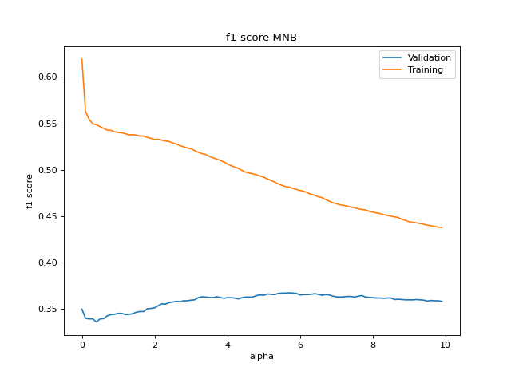

\begin{center}
Linköping University

Text Mining (732A92)
\end{center}


```{r setup, include=FALSE}
knitr::opts_chunk$set(echo = F, warning = F, message = F)
```

\newpage


# Abstract

This paper will focus on the hypothesis that models that has "memory" and takes 
the ordering of the words in consideration when classifying which music genre 
only using the lyrics, hence, the ordering of the words gives additional information
to the predictions. This was made possible by using the 
dataset “Spotify music genre list and 80k songs/tracks” @kaggle I was able to
receive music genre from each song, but unfortunately not the lyrics. Using the
combinations between Spotify API and Genius lyrics API there was possible to retrieve the
correct lyric to the matching song. The paper will compare three models, 
Gated Recurrent Unit (GRU), Long Short-Term Memory (LSTM) as models with memory 
and the Multinomial Naive Bayes classifier (MNB) as model without memory. The results
shown that both the GRU and LSTM both preformed as well as the MNB. Given the data 
material and the selected models for the study, we can assume that when it comes 
to predicting which music genre, the order of the words may not have a major impact, 
but which words used have the greatest impact on the predictions.


\newpage


\tableofcontents 


\newpage


# Introduction 

In this paper we test the hypothesis that the ordering of the words in 
a lyric gives additional information to predictions of the song genre. 
Where I selected two similar models as my models that takes the ordering
of the words in consideration like Gated Recurrent Unit and 
Long Short-Term Memory. Even if they are similar as explained 
in the method part of the paper, it gives us additional information 
regarding whether the hypothesis is accepted or not. For my non memory 
model I selected a simple Multinomial Naive Bayes classifier. 

One major part of the work was collection of data, because, finding datasets
that both consisted of the lyrics and the given genre from each song was not
available at the moment of the paper was written. So, I had to create it myself, using the 
“Spotify music genre list and 80k songs/tracks” @kaggle dataset with combinations
with Spotify API and Genius lyrics API I manage to retrieve the dataset that was
needed to finish the study. Since the dataset consisted of 120 different 
genre from the clean dataset with the smallest group of two songs in it
I needed to reduce the number of genres. By selected the 20 largest genre groups from 
the English lyrics, which resulted in over 400 different songs in each genre group.

In the end the paper concludes that given the data and models used, that 
models that consider the ordering of the words does not have a significant 
impact on the accuracy of the model.


\newpage

# Lyrics

There was no available dataset that fitted the idea to classify the song genre 
using the lyrics. To be able to solve the problem I first downloaded the dataset 
“Spotify music genre list and 80k songs/tracks” @kaggle referred as songDB,
I was able to get 
the genre from each song but not the lyrics from all over the world. This was 
solved by using both the Spotify API, @spotify, to acquire the song name 
and artist. Later, by using the lyricsgenius library, @lyricsgenius, to get the song lyrics 
from a given song title and artist. Downloading the lyrics was time consuming, 
each lyric takes up to 3 seconds to download, because of the limitations 
of the API. 

## Cleaning the lyrics

There was a need of cleaning the text by removing explanatory parts of the text, 
i.e. verse, solo etc., shown in Appendix Figure 16 and 17. And some of the lyrics consisted of multiple languages
in the same string. This problem was solved by identifying that if the existed 
an English version of the lyrics it was shown by ether [English] or 
[English Translation] with this information I was able to remove the non-English 
parts of the lyrics, illustrated in Appendix Figure 19 and 20. 


## Classifying language

Since music lyrics may consist of made-up words or borrowing words or sentences
from different languages. I was able to match the language of each lyrics using 
the *spacy* library function *spacy_langdetect* that detects which language each 
sentence of a text with a probability. To classify a lyric to a specific language
I added all the probabilities from each language class and selected the highest 
value as the lyric’s language, illustrated in Appendix Figure 18. 


## Lyrics after cleaning

Using the lyricsgenius library to get the lyrics had some problems with lyrics to
songs related to plays and movies and returns the whole lyrics to a play or movie. 
According to @guinnes the most words in a single song is held by
"Eminem" with the song "Rap God", with has a total words of 1560 words. 
This led to the number of words of the dataset visualized in the Figure 1, with 
the average number of words in a song lyric to be $289.7$. The problem was 
solved by removing lyrics with more than 1560 words.

{height=20%}

\newpage

One other problem was that there exist 117 different music genre in the *songDB* 
dataset joined with the English lyrics cleaned dataset. 
In some cases the genres are named after the country plus the genre, e.g. 
celticmetal and balkantrap into metal and rap, shown in Appendix GitHub repository. 
With this method I reduced the number of genres from 117 to 59, and selected 
the top 20 music genres, shown in the Figure 2. 

{height=30%}

The total dataset after all the cleaning and removing the non
English songs were left with a total of $26,912$ lyrics.


\newpage

# Methods

In this paper we focus on two different text classification methods to 
try classifying the song genre only using the lyrics, one method that has the 
ordering of the words as a consideration (Long Short-Term Memory) and the other 
method that does not (Multinomial Naive Bayes). 

## Neural Network with memory

### Recurrent Neural Networks

Machines are build by humans and can sometimes be similar in the way they think
and understand certain things. Words are one of these things that are not easily 
understandable form one word, you may need previews words to understand the meaning
of the word in question. Recurrent Neural Network RNN deals with this issue with 
networks with loops that allowing the information to persist, and the outputs
used as a input while having hidden states. @lstmb


{height=20%}


In the Figure 3, the chunk of a neural network, has the input $x^{t}$, 
with the activation $a^t$ has the outputs a value $y^{t}$ @lstmb.
The loop allows the information to be passed from one step to one other step,
where,


$$a^t = g_1(W_{aa}a^{t-1}+W_{ax}x^t+b_a)$$

and 

$$y^t=g_2(W_{ya}a^t+b_y)$$

We define $W_{aa},W_{ax},W_{ya},b_a,b_y$ as shared temporally coefficients and
$g_1$ and $g_2$ are activation functions. @stanford


{height=40%}

In Figure 4, we get a more visualized view of RNN and how the corresponding 
coefficients and activation functions working together, @stanford.

\newpage

Compared to other classifying methods that exist is possibility to processing 
input of any length and the size of the model does not increase with the size 
of the input. We can as describe above access historical information into 
account of computations and the weights are shared across time. The disadvantages
of using RNN is that the computations are slow, difficulty of accessing
information on a large time frame and it cannot consider information any future 
inputs. @stanford


#### Loss Function 

In a RNN we define the loss function as $\mathcal{L}$. In this paper I use the 
categorical crossentropy loss function, that is designed for multiclass 
classification tasks. The Loss function is directly
related to the activation function used in the output layer. That computes the 
total loss of the model,


$$\mathcal{L}= \sum_{t=1}^{Y_n}y_i\times\log\hat y_i$$

Where the $\hat y_i$ is the $i-th$ scalar value in the output of the model and 
$y_i$ is the corresponding target value, that matches the output size. @peltarion

At a given time T, the derivative of the loss with respect to W is expressed as, 


$$\frac{\partial  \mathcal{L}^T}{\partial W} = \sum_{t=1}^T \frac{\partial \mathcal L^T}{\partial W}\bigg|_t$$
@stanford


#### Sigmoid

Sigmoid or Logistic activation function, is a function with the characteristics
that only can return a value strictly between 0 to 1. the function is both 
differentiate and monotonic, but the functions derivative is not monotonic.
the sigmoid function is defined as,


$$g(z)=\frac{1}{1+e^{-z}}$$

@sagar


#### Tahn

Tahn also known as the hyperbolic tangent activation function that has a range
strictly between -1 to 1, similar to the sigmoid function, Tahn is also 
differentiate and monotonic, but the derivative is not monotonic.
The function is mostly used as a classifying method between two classes. @sagar

The Tahn function is defined as,

$$g(z) = \frac{e^z-e^{-z}}{e^z+e^{-z}} $$
@stanford


#### Softmax

The softmax function transform a vector of N real values into N real values 
that will sum up to 1. That means that they can be interpreted as probabilities
for a given class. The softmax formula, 

$$g(z)_i = \frac{e^{z_i}}{\sum_{j=i}^Ke^{z_j}} $$
where K is the number of classes in the multiclass. @softmax

#### Exploding/Vanishing Gradient and Gradient Clipping

As discussed, the RNN may have problems capture ling term dependencies 
of multiple layers because of the multiplicative gradient that can be decreasing 
or increasing exponentially. Therefore, it's common to have vanishing and exploding
gradient to discard the exponentially changing gradient problem. 

The technique used to cope with the exploding gradient is called Gradient Clipping. 
The technique is to chopping the maximum value of the gradient, as shown in Figure 5.

```{r,eval=F}
library(latex2exp)
png("images/gradient.png",width = 400,height = 300)
x <- seq(0,8,0.1)
y <- ifelse(x < 4,x,4)
plot(x,y,type='l', col="green",ylim=c(-.5,5),xaxt='n',yaxt='n',ylab="",xlab="",
     main="",xlim=c(0,6))
abline(h=0,v=0,col="gray",lty=3)
lines(x=c(4,4),y=c(-.3,.3))
lines(x=c(-.3,.3),y=c(4,4))
lines(x=c(.3,4),y=c(4,4),lty=3,col="darkgray")
lines(x=c(4,4),y=c(.3,4),lty=3,col="darkgray")
text(x=1,y=4.5,TeX("|| $\\Delta L$ ||_{clipped}"))
text(x=5,y=.5,TeX("|| $\\Delta$L ||"))
text(x=.2,y=3.4,"C")
text(x=3.6,y=.2,"C")

#save.image("images/gradient.png")
dev.off()
```


\newpage

### Long Short-Term Memory

The core idea of the Long Short-Term Memory (LSTM) is to get a horizontal line
running through the cell, so the information from previews cells with only some
minor linear interactions. That gives the LSTM the ability to remove or add
information to the cell state under carefully regulated structures we define as 
gates $(\Gamma)$. The gates are used as a way to let the information pass through, composed
out of a sigmoid neural net. Using the characteristics of the sigmoid function, 
the output from each sigmoid layer illustrates how much each component should be
let through. @lstmb

The gates are used to manage the gradient problem, specific gates are used in 
some types of RNN, and equal to, 

$$\Gamma = \sigma(Wx^t+Ua^{t-1}+b) $$

where $\sigma$ is the sigmoid function and $W,U,b$ are specific coefficients to 
the gate, @stanford. There exists 4 different types of gates in LSTM described in table 1.  

\begin{table}[!h]
\begin{center}
 \begin{tabular}{c | c} 
 \hline
 Types of gates ($\Gamma$) & Role of the gate \\ [0.5ex] 
 \hline
 $\Gamma_u$, update & How much of the past should be considered? \\ 

 $\Gamma_r$, relevance & Previous information drooped?  \\
 
 $\Gamma_f$, forget & If the cell should be drooped? \\

 $\Gamma_o$, output  & How much is revealed from a cell? \\[1ex] 
 \hline
\end{tabular}
\caption{4 different types of gates, Amidi and Amidi (2019)}

\end{center}
\end{table}

We define the characterization functions as $c'^t, c^t, a^t$, where

$$c'^t = tanh[W_c(\Gamma_r \times a^{t-1},x^t) + b_c] $$

$$c^t=\Gamma_u\times c'^t+\Gamma_f\times c^{t-1} $$

$$a^t=\Gamma_o\times c^t $$

In Figure 6, we can see a visualized image of the dependencies with the 
characterization functions.


{height=40%}

\newpage

### Gated Recurrent Unit

Gated Recurrent Unit (GRU), can be considered as variation on the LSTM because of their design
and in some cases, produces similar results. GTU tries to reduce the vanishing gradient problem which 
consists in standard RNN, it can also be seen as a improved version of the RNN. It uses so called
*update gate and reset gate*, as mentioned in LSTM the gates controls the information that is 
passed through the cells. @gru

The GRU has two different types of gates, the two first mentioned gates in Table 1, Update gate $\Gamma_u$ and 
Relevance gate $\Gamma_r$, with the characterization functions defined as:


$$c'^t = tanh[W_c(\Gamma_r \times a^{t-1},x^t) + b_c] $$

$$c^t=\Gamma_u\times c'^t+(1-\Gamma_u)\times c^{t-1} $$

$$a^t= c^t $$

@stanford

{height=40%}


### Dropout

Dropout is a technique that is designed for reducing overfitting in feedforward 
neural networks. The idea is that during training interactions each neuron is omitted 
from the network with the probability $p$. When the training is completed all 
neurons are returned and the network predicts using all neurons. Where the basic idea 
of the behavior of the dropout can be expressed as the activation function composed with
the dropout,


$$y = f(Wx)\circ m$$

where $m_i\sim Bernoulli(p)$ is the dropout layer. The method is proven to reducing 
overfitting for models trained over long periods (epoch). @dropout


## Multinomial Naive Bayes classifier

### Naive Bayes

The Naive Bayes Classifier is a machine learning algorithm known for its "naive" 
assumption of conditional independence between each pair of features given the 
class variable, @NB. We assume that the input and output data consist of $N$ 
instances, $x_i = x_{i1},x_{i2},...,x_{ip}$, where $i=1,...,N$ and consists 
of p attributes and the class variable $y$. Using the Bayesian probabilistic 
model that assigns a posterior class probability to an instance, $P(Y=y_j|X=x)$
and applying the Bayes theorem we obtain,

$$P(y_j|x_1,x_2,...,x_N) = \frac{P(x_1,x_2,...,x_N|y_j)P(y_j)}{P(x_1,x_2,...,x_N)}$$
@bayes

With the assumption conditional independence, we assume that 
 $P(x_i|y_j,x_1,x_2,...,x_n) = P(x_i|y_j)$. So, we can obtain, 

$$P(y_j|x_1,x_2,...,x_N)=\frac{P(y_j)\prod_{i=1}^NP(x_i|y_j)}{P(x_1,x_2,...,x_N)}$$

We know that the denominator $P(x_1,x_2,...,x_N)$ is constant so simplify by, 

$$\propto \arg\max_y P(y_j)\prod_{i=1}^NP(x_i|y_j)$$
$$\hat y= \arg\max_{y_j} P(y_j)\Pi_{i=1}^NP(x_i|y_j)$$

@NB


### Multinomial Naive Bayes

The Multinomial Naive Bayes (MNB) is one of the most common uses of machine learning
algorithms to classifying multidimensional classes. Starting by computing each 
class fraction $\pi_j$ by computing the fraction of each class with the equation,


$$\pi_j = \frac{class_j}{\sum_{l=1}^Lclass_l} $$

where $L$ is the total number of words. @mult

For computing the probability for each word given a glass, we need to compute 
the average of each word for each given class, using the following formula, 

$$P(W|y_j) = \frac{word_{wj}}{word_j}$$

Since they might exists some words that does not consist in a given class we 
need to assign Laplace Smoothing with a low $\alpha$ value. $\alpha$  represents 
the smoothing value for the words that may not exists, or does not appear in the 
training data. And $|V|$ is an array of all the words in the vocabulary. We are 
therefore using following method to estimate the probability 
of each word given a class,

$$P(W|y_j) = \frac{word_{wj} + \alpha}{word_j+ |V|+1}$$
@mult


We can now combine the probability distribution of P with the fraction $f$ of documents
belonging to each class $y_j$, 

$$P(y_j) \propto\pi_j\prod_{i = 1}^{|V|}P(i|y_j)^{f_i}) $$

By using the natural logarithm we can avoid potential underflow, 

$$P(y_j) = \log \pi_j + \prod_{i=1}^{|V|}f_i\log P(i|y_j) $$

One more issue to deal with, if a word appears more than once for a given class, 
the probability of it appearing again goes up. So, we need to be smoothing this we 
replace $f_i$ with $\log (f_i+1)$.
 

$$P(y_j) = \log \pi_j + \prod_{i=1}^{|V|}\log (f_i+1)\log P(i|y_j) $$

@multi


\newpage

# Preparing

Before fitting the models/networks, I removed all stop-words and non-alphabetical characters
from the lyrics using the spacy library. Because removal of 
the stop-words from the text so, the models can focus on the tokens that are
if there is any of each genre of songs, @NLP. That is also why we do not need to 
take in consideration of stop words in the MNB.


## Training /validation and test

In this paper I used a training validation and test data strategy to compare 
the two models between them. Since the LSTM preforms better with a larger 
training data set I used the following split of the total dataset shown in 
Table 2.

\begin{table}[h!]
\begin{center}
 \begin{tabular}{c | c | c} 
 \hline
 Type of data & Percentage & Count \\ [0.5ex] 
 \hline
 Training & $85\%$ & 22875 \\ 

 Validation & $10\%$ & 3028   \\
 
 Test  & $5\%$ & 1009 \\[1ex] 
 \hline
\end{tabular}
\caption{Training, Validation and test size}

\end{center}
\end{table}


## Overfitting problems

For fitting the LSTM and the RNN models I had major problems with overfitting, due to 
having large difference in the accuracy from training and validation, shown in the 
Appendix Figure 21. According to @kd there are some techniques to preventing 
overfitting while training neural networks. Using a simplified model can help 
avoiding the model to overfitting the training data. This can be done by 
reducing the number of neurons to make the networks smaller. One can also use 
Dropouts to prevent overfitting. So, for preventing the overfitting using Dropout 
layers and reducing the complexity of the models was used.

\newpage

# Results

## LSTM

For both the LSTM and GRU the Tokenizer from the tensorflow library was used as
vectorizer to fit the maximum vocabulary size for the lyrics data. And get_dummies
function from the pandas library to get the $Y$ data to retrieve the correct dimensions,
shown in the Appendix GitHub repository. 


* Total vocabulary size of $8000$
* Embedding dimensions to $64$
* The maximum length of words to $200$

The network are shown in Figure 8. 

{height=30%}

Using dropout after the initial layers with the probability of $0.2$ and
after the second layers of LSTM with the probability of $0.5$. Even when 
using two dropout layers the network still suffer from overfitting, shown 
in the Figure 9.


{height=30%}


{height=30%}

In Figure 10 we observed the results from the LSTM, 
overall, the result for LSTM shows that the network are returning 
a test accuracy of $0.359$ to 20 classes. With a precision over the 
genres vary between 0 and 0.68, recall is between 0 and 0.8 and f1-score 
is between 0 and 0.7. The network did not predict rave once, hence the 
zero in precision and recall. And the best predicted genre was
Doo-Wop.


\newpage

## GRU

* Total vocabulary size of $8000$
* Embedding dimensions to $64$
* The maximum length of words to $200$

The network are shown in Figure 11. 


{height=30%}

Using dropout after the initial layers with the probability of $0.2$ and
after the simple RNN layers with the probability of $0.5$. Like the LSTM 
the network still suffers from overfitting, shown in the Figure 12.


{height=30%}


{height=30%}

GRU results shown in Figure 13, the result for GRU shows that the network are returning 
a test accuracy of $0.356$ to 20 classes. With a precision over the 
genres vary between 0 and 0.79, recall is between 0 and 0.69 and f1-score 
is between 0 and 0.73. The network did not predict go-go once, hence the 
zero in precision and recall. And the genre with the highest score was Worship.


\newpage

## MNB


For the MNB model I fitted the data with the highest $f1-score$ by using the training data 
and the validation data to find the optimum value of $\alpha$. This was done by testing
the values between (0,10), shown in Appendix GitHub repository. Using a high $\alpha$ we can
reduce the overfitting problem with the cost of flexibility in the model.


{height=30%}

Using $\alpha=5.5$, where the maximum validation accuracy lies, 
to predict on the test data we recive a model to simple for prediction over 
all the genres, shown in Figure 14.

{height=30%}


MNB results in Figure 15, the result for MNB classifier shows that the model are returning 
a test accuracy of $0.370$ to 20 classes. With a precision over the 
genres vary between 0 and 0.67, recall is between 0 and 0.83 and f1-score 
is between 0 and 0.73. The model did not predict go-go, blues, nuelectro nor rave once, hence the 
zero in precision and recall. And the genre with the highest score was Worship.


\newpage


## Summary

In Table 3 illustrates the summary of the results from above. Were, the highest
accuracy was given by the MNB model, but the model had the most zero predictions
over the genres. Overall, the results has a similar result with an 
accuracy between $35\%-37\%$. 


\begin{table}[h!]
\begin{center}
 \begin{tabular}{c | c | c} 
 \hline
 Model/Network & Accuracy & f1-score min-max\\ [0.5ex] 
 \hline
 LSTM & 0.359 & 0.00-0.70  \\ 

 GRU &  0.356 & 0.00-0.73 \\
 
 MNB  & 0.370 & 0.00-73 \\[1ex] 
 \hline
\end{tabular}
\caption{f1-score on the test data}

\end{center}
\end{table}


\newpage

# Discussion 

## Data Management

One of the main problems with this paper was with the data manage part, and most of
the time spent on this project went to processing and collection of the data. And 
when I got all the data working and processed as requested by the models, I was left
with about one third of the data collected. 
Since there was no way of saying if what language the lyric would have been from just 
looking at the dataset songDB, even with the Spotify API there was no way of identifying
the language. That lead me to first downloading the lyrics then classifying the 
language of each lyric before saving or discarding the lyric based on language or
that the song was too large to be a lyric. This way was working but with the cost of time. A single 
lyric took between 1-10 second to download based on size and the limitations of 
both API used. 

Groping lyrics into larger groups may or may not have been wise choice. In one 
hand I received a larger amount of data on the other hand, 
the smaller genre may have been completely different in what word are used in 
the lyrics and may have affected the results in a negative way. 

Selection of only 20 genres, was made because of the small dataset for LSTM models, 
and there was hard to find reliable sources on what sizes of data set is the 
"rule of thumb" to each classes, some said at least 1000 and some said larger than 5. 
But with selecting the 20 largest genres I was able to get over 400 lyrics for 
the smallest genre.


## Results 

 
The models selected to the classifying problem may not have been the best suited to
the problem, I believe that a simpler model may predict as well or better. Because, of
the MNB model preforms as well as both the GRU and LSTM. Hence, the hypotrophy’s that 
models that has "memory" or taking the ordering of the words in consideration are 
to prefer when predicting music genres using the lyrics. Why the MNB preformed as well as 
than both the LSTM and GRU, is unclear but I would guess that both of the 
Neural network models in general trains large dataset, much larger than
the dataset used in this paper and in this case did not have enough data. 
It could also be because I was not able to find the 
best model given the dataset. But, at last and probably the most likely, it could also be because the ordering 
of the words for predicting the lyrics does not provide any additional useful information. 
So, in that case, we can assume that the ordering the words may not have a major impact on 
the prediction, but the words used in the lyrics has the greatest impact on the predictions.


\newpage

# Program, Library and hardware

Program: 

* python 3.7.8 was used for testing and results
* Drawio/R-studio was used to create the Figures 

library and version: 

* pandas, version 1.1.5
* numpy, version 1.19.3
* matplotlib, version 3.3.3
* tensorflow, 2.4.0
* sklearn, 0.24.0
* spacy, 2.3.5
* spacy_langdetect, n.v.


Computer hardware:

* Processor: AMD Ryzen 5 4600H
* RAM: 8,00 GB
* Graphics card: GeForce GTX 1650

Operating system: Windows 10 Home 64 bit 

\newpage

# References {-}

<div id="refs"></div>

\newpage

# Appendix 

[**Github repository**](https://github.com/harjew/732A92-proj) *(if there is any problem contact me at harwi937@student.liu.se)*

 


\newpage


\newpage

{height=40%}

\newpage


